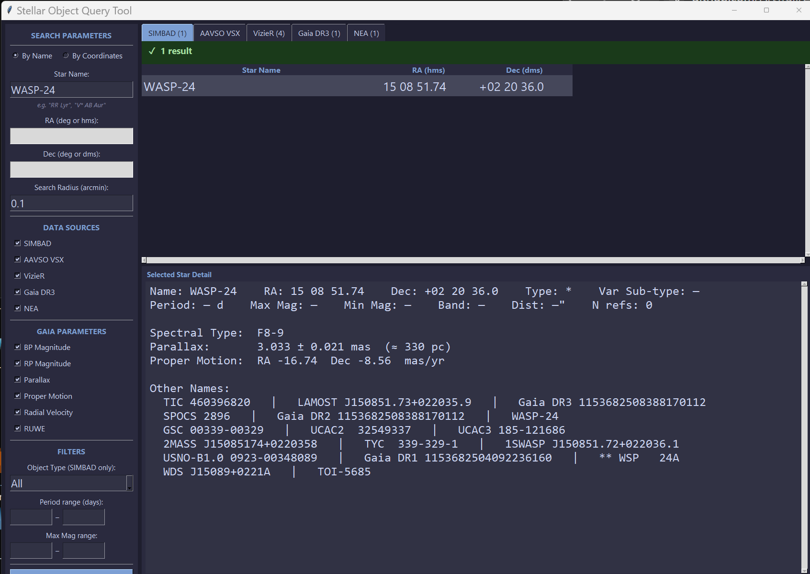

# SOQyT — Stellar Object Query Tool

A Python/Tkinter desktop application for querying multiple astronomy databases by star name or sky coordinates.



## Features

- **Multi-database queries** — search SIMBAD, AAVSO VSX, VizieR, Gaia DR3, and NEA simultaneously
- **Two search modes** — by star name (e.g. `WASP-24`, `RR Lyr`) or by sky coordinates with a cone search radius
- **Tabbed results** — each data source has its own results tab showing match counts
- **Selected Star Detail** — click any result row to see a full summary: RA/Dec, type, period, magnitude, spectral type, parallax, proper motion, cross-IDs, and more
- **Gaia DR3 parameters** — configurable columns including BP/RP magnitude, parallax, proper motion, radial velocity, and RUWE
- **Filters** — narrow results by SIMBAD object type, period range, and magnitude range
- **VizieR sub-tabs** — results from multiple VizieR catalogues displayed in separate tabs
- **NEA sub-tabs** — exoplanet archive results organized by sub-category

## Requirements

- Python 3.10+
- Internet connection (all queries are live API calls)

Dependencies are installed automatically by the launcher, or manually:

```bash
pip install requests openpyxl
```

The following standard-library / well-known packages are also used:
- `tkinter` (included with Python)
- `astropy` (for coordinate parsing)

## Installation & Usage

```bash
# Run directly
python star_query_tool.py

# Or use the included launcher (installs dependencies automatically)
run.bat
```

1. Enter a **Star Name** (e.g. `WASP-24`) or switch to **By Coordinates** and enter RA, Dec, and search radius.
2. Check the **Data Sources** you want to query.
3. Click **Search**.
4. Click any row in the results to see full details in the **Selected Star Detail** panel.

## License

MIT License — © Arthur T. Trail 2026. See [LICENSE](LICENSE) for details.
