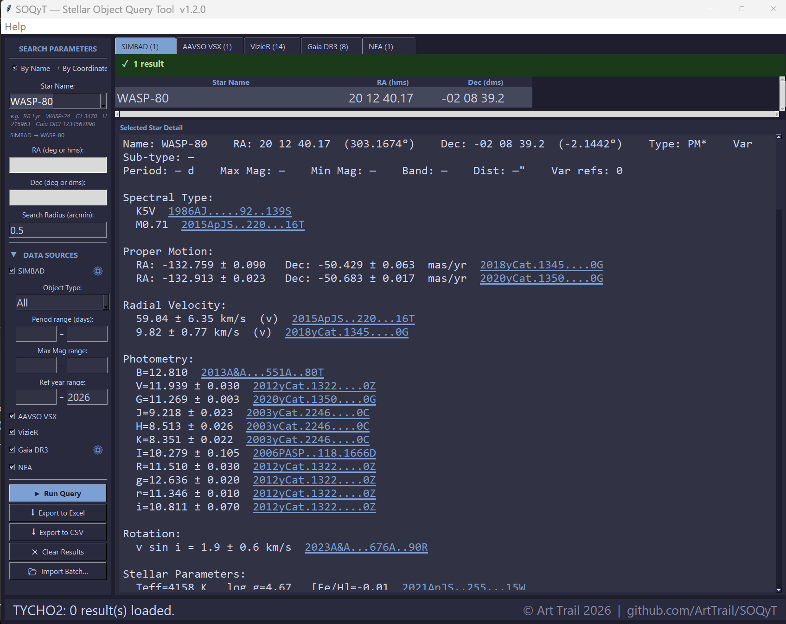
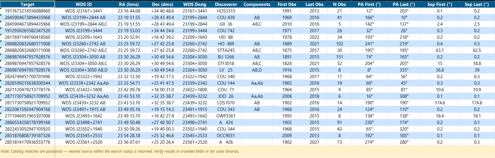

# SOQyT — Stellar Object Query Tool  v1.2.0

A Python/Tkinter desktop application for querying multiple astronomy databases simultaneously by star name or sky coordinates. Results are displayed in tabbed panels with full per-star detail and can be exported to Excel or CSV.



## Data Sources

| Tab | Catalog | What you get |
|-----|---------|-------------|
| SIMBAD | CDS SIMBAD | Main ID, RA/Dec, object type, spectral type, parallax, proper motion, radial velocity, photometry, stellar parameters, cross-IDs, bibliography |
| AAVSO VSX | AAVSO Variable Star Index | Variable type, period, magnitude range, epoch, remarks, references |
| VizieR | 2MASS (II/246) | J, H, K photometry + errors, quality flags |
| VizieR | AllWISE (II/328) | W1–W4 mid-IR photometry + errors, quality flags |
| VizieR | APASS DR9 (II/336) | V, B optical photometry + errors |
| VizieR | Tycho-2 (I/259) | BT, VT photometry, proper motions |
| VizieR | WDS (B/wds) | Double star separations, position angles, discoverer codes |
| VizieR | Orb6 (B/orb6) | Visual binary orbital elements |
| Gaia DR3 | ESA Gaia DR3 | G/BP/RP magnitudes, parallax, proper motion, radial velocity, RUWE |
| NEA | NASA Exoplanet Archive | Planet and host star parameters, discovery details |

## Features

- **Two search modes** — by star name/identifier (e.g. `WASP-80`, `RR Lyr`, `Gaia DR3 1234567890`) or by RA/Dec with a configurable cone search radius
- **Tabbed results** — each data source has its own tab; tab labels show match counts
- **Selected Star Detail** — click any result row for a full detail panel: coordinates, object type, spectral classifications, measurements with uncertainties, and clickable ADS bibcode links for every measurement
- **Configurable columns** — gear buttons on SIMBAD and Gaia DR3 tabs let you toggle which measurement sections and parameters are shown
- **Filters** — narrow SIMBAD results by object type, period range, and magnitude range

## Batch Mode

Import a CSV or Excel file (.csv, .xlsx, or .xls) and query every target automatically.

- **Name mode** — one star name per row; resolves through SIMBAD
- **Coordinate mode** — RA/Dec columns with a single search radius; optionally map a name column so exports show star names instead of coordinates
- **Auto-Run** — steps through all targets unattended; automatic 45-second server cooldown every 150 targets to prevent timeouts on large lists
- **Navigation** — step forward/back manually or jump directly to any target

## Export

Results from all data sources export together into a single multi-sheet Excel workbook, or as a flat CSV.



- One sheet per catalog (SIMBAD, AAVSO VSX, 2MASS, AllWISE, APASS, Tycho-2, WDS, Orb6, Gaia DR3, NEA)
- Six dedicated SIMBAD measurement sheets (SpT, Plx, Dist, PM, RV, Rot) — always present, with a "no data" notice when empty
- Sheets with positional matches (2MASS, AllWISE, APASS, Tycho-2) export the nearest match per target
- Bibcode columns hyperlinked to ADS
- Freeze panes at B2; center-aligned cells; alternating row shading per catalog color

## Requirements

- Python 3.10+
- `requests`, `openpyxl`
- `xlrd` (only needed for `.xls` input files)
- Internet connection — all queries are live API calls

Dependencies are installed automatically by the launcher, or manually:

```
pip install requests openpyxl xlrd
```

`tkinter` is included with Python.

## Running

```
# Launcher (installs dependencies automatically, then runs)
run.bat

# Or directly
python star_query_tool.py
```

## Windows Executable

A pre-built Windows onedir executable is available on the [Releases](https://github.com/ArtTrail/SOQyT/releases) page — no Python installation required. Extract the zip and run `Stellar Object Query Tool.exe`.

## License

MIT License — © Art Trail 2026. See [LICENSE](LICENSE) for details.
